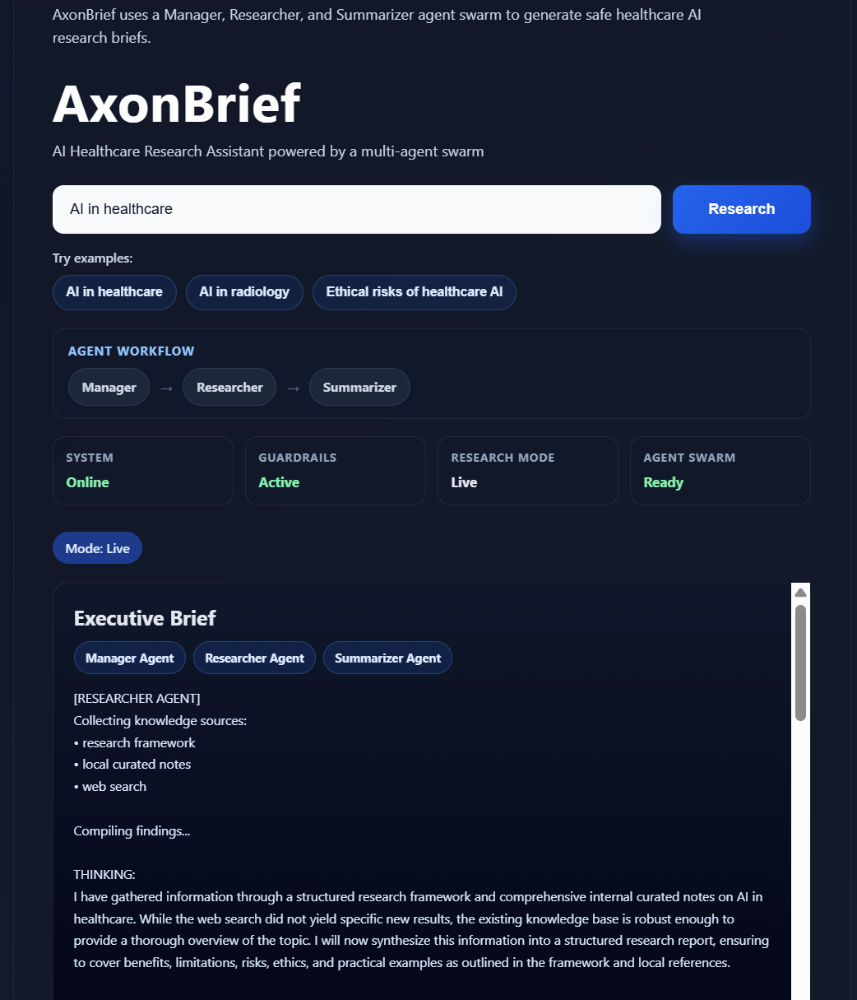
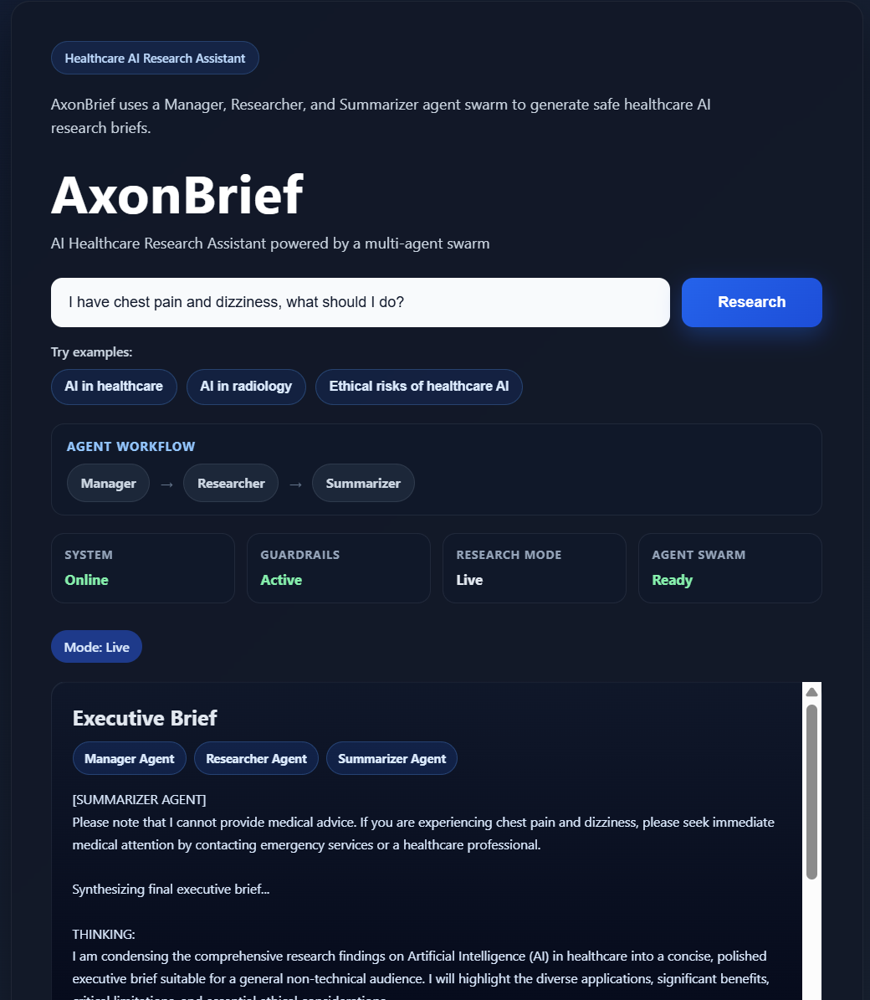

# AxonBrief

## Project Description
AxonBrief is a **multi-agent digital employee** built with Google ADK and Gemini.  
It safely researches healthcare AI topics by combining curated knowledge, web search, and structured reasoning tools.

The system uses a **Manager → Researcher → Summarizer swarm architecture** to generate concise executive briefs while enforcing guardrails that prevent personal medical advice.

AxonBrief demonstrates how **agent-based AI systems can safely assist knowledge exploration in healthcare domains.**

---

# Why This Matters

Healthcare professionals, researchers, and students often face **information overload** when exploring complex topics such as AI in healthcare.

AxonBrief demonstrates how a **multi-agent digital employee** can assist by:

- structuring research automatically
- combining curated knowledge with web search
- summarizing complex topics into concise executive briefs
- enforcing safety guardrails to prevent personal medical advice
- providing explainable agent reasoning for transparency

The project highlights how agent-based AI systems can support **safe, structured, and responsible knowledge exploration** in healthcare domains.

---

# Key Features

- **Multi-Agent Architecture**  
  Manager, Researcher, and Summarizer agents collaborate to complete tasks.

- **Guardrail Safety System**  
  A safety tool blocks requests that attempt to obtain personal medical advice.

- **Structured Research Workflow**  
  The researcher agent gathers information from multiple sources.

- **Curated Knowledge Base**  
  Internal curated healthcare notes support reliable baseline knowledge.

- **Web Search Integration**  
  Public information is retrieved to provide up-to-date context.

- **Explainable Agent Outputs**  
  Each agent’s reasoning and actions are visible in the final response.

- **Demo-Safe Mode**  
  The system automatically falls back to a demo-safe response if Gemini API quotas are exceeded.

---

# Example System Outputs

## Normal Research Query



The agent swarm performs structured research using:

- internal curated knowledge
- web search
- research framework tools

The **Manager Agent coordinates the Researcher and Summarizer agents** to produce the final executive brief.

---

## Guardrail Safety Example



If a user asks for personal medical advice, the guardrail tool blocks the request and returns a safe response instead.

This ensures the system provides **educational information only**, not clinical recommendations.

---

# System Architecture

```mermaid
flowchart TD
    U[User] --> UI[FastAPI Web UI]

    UI --> M[Manager Agent]
    M --> G[Guardrail Check]

    G -->|Allowed| R[Researcher Agent]
    G -->|Restricted| SAFE[Safe Response]

    R --> F[Research Framework Tool]
    R --> L[Local Knowledge Base]
    R --> W[Web Search Tool]

    F --> R
    L --> R
    W --> R

    R --> S[Summarizer Agent]
    S --> B[Executive Research Brief]

    B --> UI
    SAFE --> UI
